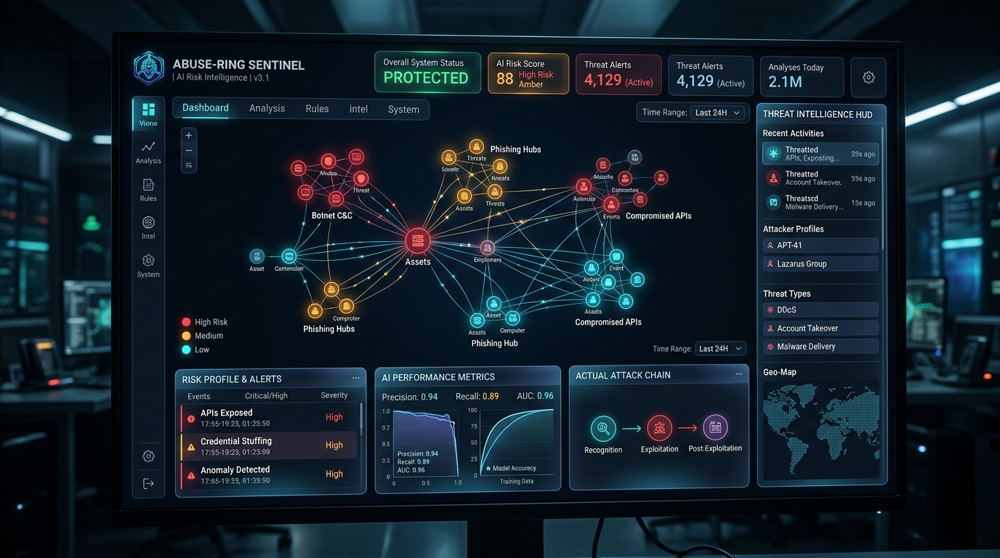
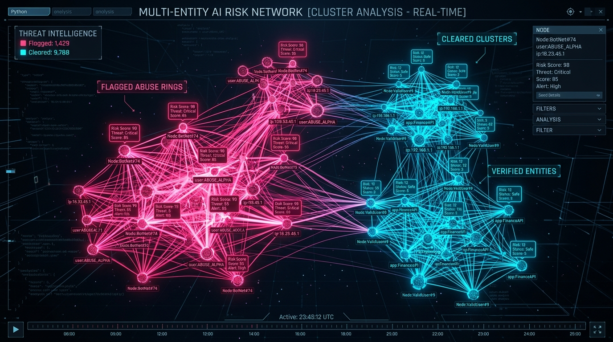
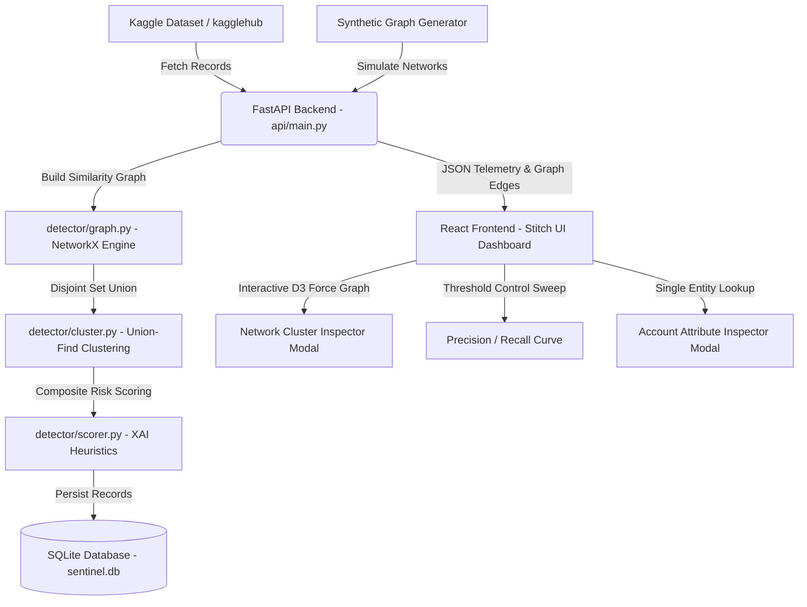

<div align="center">

# 🛡️ ABUSE-RING SENTINEL
### *AI-Powered Multi-Entity Risk Intelligence & Coordinated Fraud Ring Detection Engine*

[](https://ai-risk-manager-coral.vercel.app)
[](https://react.dev/)
[](https://fastapi.tiangolo.com/)
[](https://www.sqlite.org/)
[](https://networkx.org/)
[](#license)

<br/>

### 🌐 Live Demo: [https://ai-risk-manager-coral.vercel.app](https://ai-risk-manager-coral.vercel.app)

<br/>



<br/>

<p align="center">
  <b>Abuse-Ring Sentinel</b> is an enterprise-grade AI risk intelligence platform built to expose coordinated fake-account networks, promotional abuse syndicates, and financial transaction fraud rings using multi-entity similarity graphs and transparent, explainable AI heuristics.
</p>

</div>

---

## 🌟 Key Highlights



- 💎 **Obsidian Glassmorphism UX**: Crystal-clear frosted glass interface designed for security analysts and risk operations teams.
- 🕸️ **D3 & NetworkX Graph Engine**: Dynamic 2D force graph visualization with PageRank & Degree Centrality graph algorithms.
- 💡 **100% Explainable AI (XAI)**: Transparent composite risk scoring across device fingerprints, credit card BINs, IP subnets, velocity bursts, and promo codes.
- 📦 **Kagglehub Dataset Pipeline**: Built-in support for **Kaggle IEEE-CIS Financial Fraud** and **Kaggle AI Automation Risk By Job Role** (`khushikyad001/ai-automation-risk-by-job-role`).
- 🗄️ **Persistent SQLite Database**: Automated audit logging of detection runs, precision/recall metrics, and flagged risk clusters.
- ⚡ **Interactive Precision-Recall Tuning**: Real-time sensitivity threshold sweep controls ($t = 0.05 \dots 0.90$) with downloadable JSON case reports.

---

## 📐 Explainable AI (XAI) Scoring Architecture

Abuse-Ring Sentinel computes a composite risk score $S(C)$ for each account cluster $C$:

$$S(C) = \sum_{k} w_k \cdot \text{sharing\_ratio}(k)$$

| Heuristic Signal | Weight ($w_k$) | Description |
| :--- | :---: | :--- |
| 📱 **Hardware Fingerprint** | **`0.35`** | Identical device hashes shared across accounts |
| 💳 **Payment Instrument** | **`0.30`** | Shared credit card BINs & payment tokens |
| ⚡ **Creation Velocity** | **`0.15`** | Account creation velocity bursts ($< 5\text{ mins}$) |
| 🌐 **IP Subnet Co-location** | **`0.10`** | Proxy subnets & shared IP addresses |
| 🏠 **Address Overlap** | **`0.05`** | Shared residential/corporate billing addresses |
| 🎁 **Promo Code Abuse** | **`0.05`** | Coordinated promotion code redemptions |

---

## 🏗️ System Architecture



---

## 🚀 Quick Start Guide

### Prerequisites
- **Python 3.10+**
- **Node.js 18+** & `npm`

### 1. Clone the Repository
```bash
git clone https://github.com/sanant456/AI-Risk-Manager.git
cd AI-Risk-Manager
```

### 2. Backend Setup
```bash
# Install Python dependencies
python3 -m pip install -r api/requirements.txt

# Start FastAPI server (Port 8000)
python3 api/main.py
```

### 3. Frontend Setup
```bash
# Navigate to frontend folder
cd frontend

# Install Node modules
npm install

# Launch Vite Dev Server (Port 5173)
npm run dev
```

Open **`http://localhost:5173`** in your browser.

---

## 🗺️ Application Navigation & User Features

```
📁 Abuse-Ring Sentinel Dashboard
├── 📊 Overview Tab
│   ├── 💳 Top Bento Metrics (Accounts Scanned, Flagged Rings, Live Telemetry)
│   ├── 🕸️ Network Cluster Analysis (Interactive D3 Force Graph + Fit Screen Button)
│   ├── 🎛️ Detection Sensitivity Slider (Real-time Threshold Sweep t = 0.05 - 0.90)
│   ├── ⚠️ Detection Traps & Edge Cases (False Positives & Evasion Alerts)
│   └── 📋 Flagged Fraud Cases Panel (Filterable Ring Lists & Inspectors)
├── 📈 Sensitivity Matrix Tab
│   ├── 💡 Explainable AI (XAI) Weight Distribution
│   ├── 📉 Interactive Precision/Recall SVG Curve Plot
│   └── 📊 Signal Distribution & Preset Benchmark Matrix
├── 📥 Dataset Ingestion Tab
│   ├── 🤖 Kagglehub AI Automation Risk Dataset (3,000 Job Roles)
│   ├── 💳 Kaggle IEEE-CIS Financial Fraud Dataset (500 Transactions)
│   └── 🎰 Synthetic Benchmark Generator
└── 📜 Audit History Tab
    ├── 🕒 SQLite Detection Run History (Precision, Recall, F1 Metrics)
    └── 🗄️ Persistent Risk Cluster Logs
```

---

## 📸 API Endpoints Reference

| Method | Endpoint | Description |
| :--- | :--- | :--- |
| `POST` | `/generate` | Load dataset source (`"ai_risk"`, `"kaggle"`, `"synthetic"`) |
| `POST` | `/detect` | Run detection pipeline with sensitivity threshold $t$ |
| `GET` | `/metrics` | Get live precision, recall, F1, and threshold sweeps |
| `GET` | `/clusters` | Get node graph edges & cluster lists for D3 rendering |
| `GET` | `/account/{id}` | Inspect detailed account attributes & ground truth |
| `GET` | `/export` | Download full case report as formatted JSON |
| `GET` | `/audit-logs` | Retrieve persistent SQLite run logs & cluster history |
| `GET` | `/health` | Health check and dataset ingestion diagnostic |

---

## 🛠️ Built With

- **Frontend**: React 18, Vite, D3.js (`react-force-graph-2d`), Vanilla Glassmorphic CSS.
- **Backend**: FastAPI, Pydantic, Uvicorn.
- **Data Science & ML**: NetworkX, Scikit-Learn, SciPy, NumPy, Pandas, Kagglehub.
- **Database**: SQLite3.

---

## 📜 License

Distributed under the **MIT License**. See `LICENSE` for more details.

---

<div align="center">
  <sub>Built with ❤️ by DeepMind Pair Programmer for Antigravity AI Risk Intelligence.</sub>
</div>
